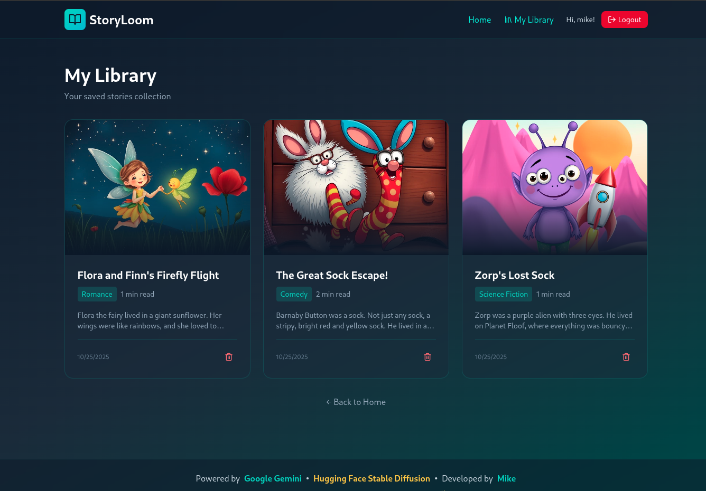
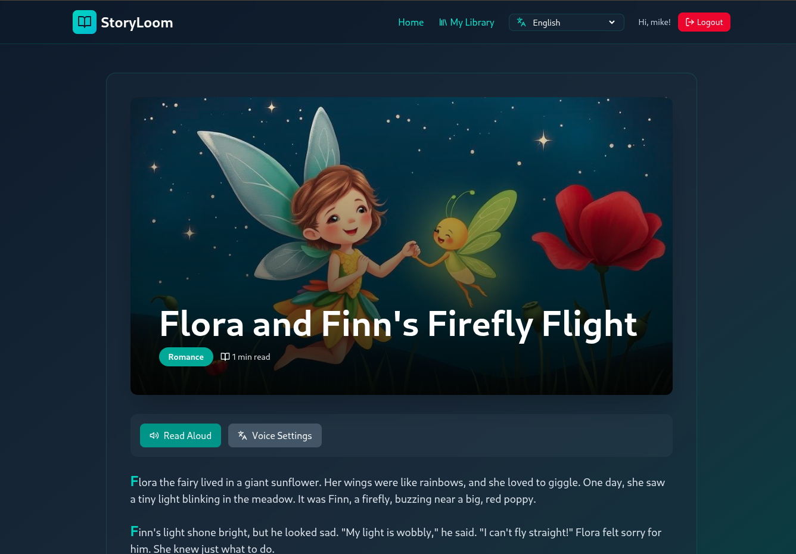

# StoryLoom

  
  

**StoryLoom** is an AI-powered storytelling web app that lets users create unique, age-appropriate stories on any theme, with beautiful AI-generated cover images. After reading, users can take a quiz based on the story, learn new vocabulary with flashcards, and translate the entire experience into multiple languages. The app also features a read-aloud mode, allowing stories to be listened to in different voices and languages.

**Main Features:**
- Generate original stories by selecting a theme, age group, and custom prompt
- AI-generated cover images that match the story
- Take quizzes to test comprehension
- Learn new words with interactive flashcards
- Translate stories, quizzes, and flashcards into many languages
- Listen to stories read aloud with adjustable voices and speed

Built with React (frontend) and Python Flask (backend), using multiple AI providers (Google Gemini or Hugging Face) with automatic fallback for story generation and Hugging Face for image creation.

## 🤖 AI Provider Support

StoryLoom supports **multiple AI providers with automatic fallback**:

- **Primary**: Google Gemini 2.0 Flash (Recommended for best quality)
- **Fallback**: Hugging Face Inference API (Mixtral-8x7B model)

The system automatically tries providers in order:
1. If Gemini is configured and available → uses Gemini
2. If Gemini fails or is not configured → automatically falls back to Hugging Face
3. If both fail → returns an error

**Benefits:**
- ✅ No single point of failure
- ✅ Works with free tier API keys
- ✅ Seamless fallback without user intervention
- ✅ Configure one or both providers

## 🚀 Getting Started

### Prerequisites
- Node.js (v16 or higher)
- Python 3.8+
- At least **one** AI provider API key (Gemini or Hugging Face)

### API Keys Setup

You need at least one of these API keys:

1. **Google Gemini API** (Recommended)
   - Get your free API key: [Google AI Studio](https://makersuite.google.com/app/apikey)
   - Free tier includes generous usage limits

2. **Hugging Face API** (Alternative/Fallback)
   - Get your free token: [Hugging Face Settings](https://huggingface.co/settings/tokens)
   - Free tier available (may have rate limits)

**Tip**: For best reliability, configure both API keys!
